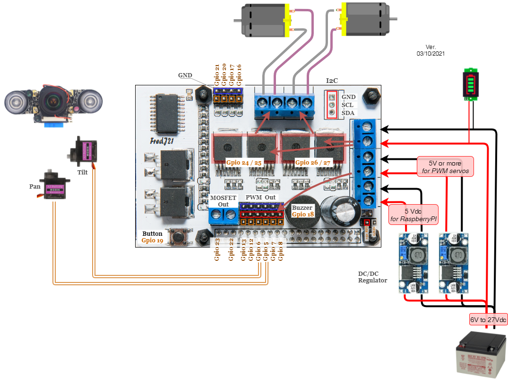
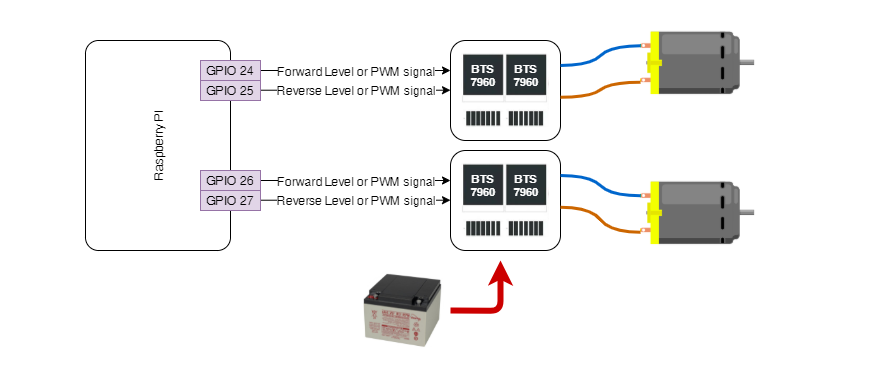
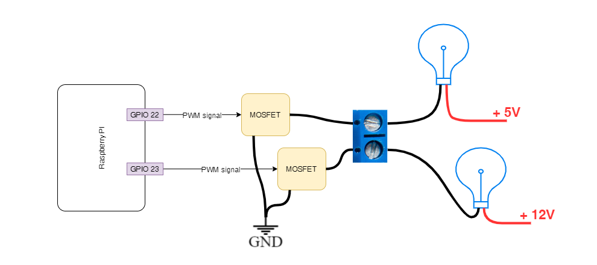
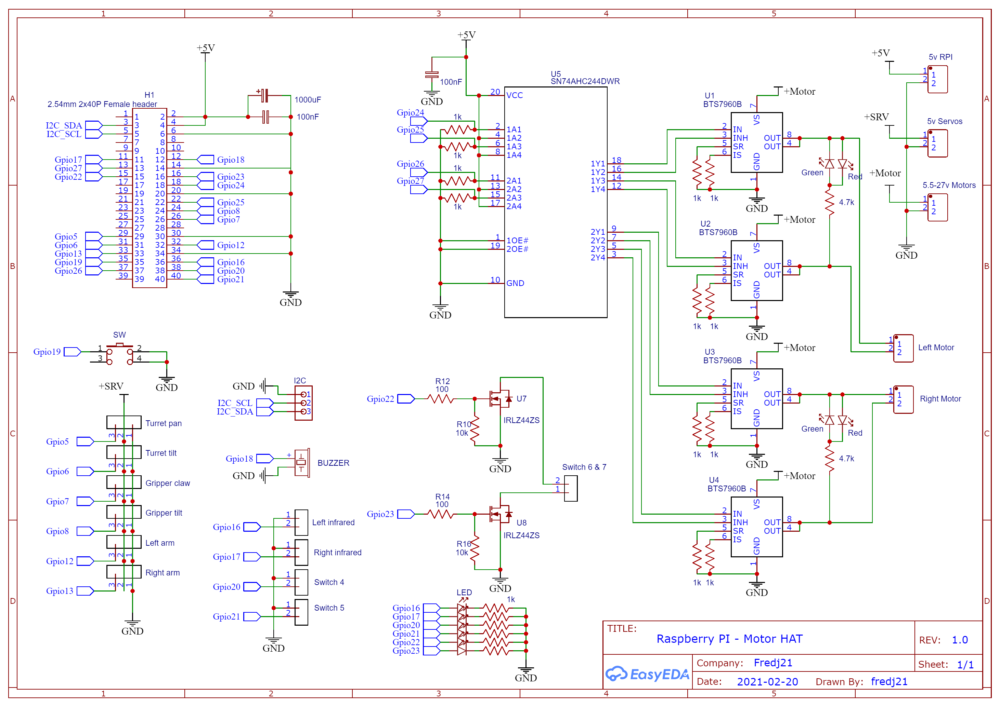
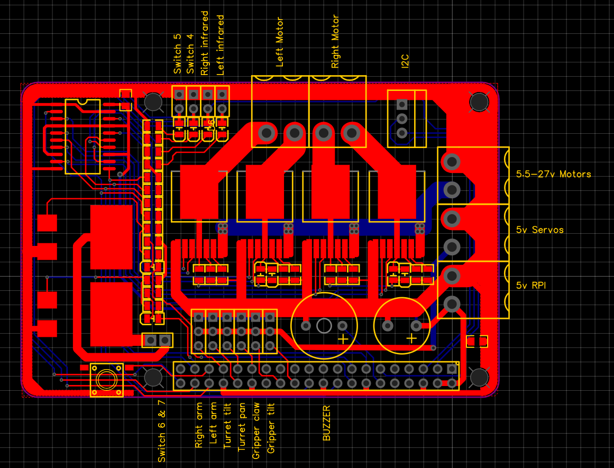

# Raspberry PI - Motor Driver Hat

| ||
|-----|-----|

### Présentation

La carte "MotorDriverHat" est une carte d'extension pour Raspberry PI 3 ou 4, permettant de piloter 2 moteurs à courant continue de forte puissance (* voir plus bas), des servos moteurs, et d'autres périphériques via les Gpio.    

Elle propose une connectivité pour les besoins en alimentation électrique et pour le raccordement des moteurs, ainsi que de multiples entrées/sorties GPIO, facilitant, par exemple, l'utilisation de servomoteurs.   

***Principales caractéristiques*** :

- entrée d'alimentation 5V pour la Raspberry
- entrée d'alimentation 5 à 7V pour les servomoteurs
- entrée d'alimentation  6 à 27V pour les moteurs
- 2 ponts en H composés de 4 BTS7960 (43 Ampères)
- Led de contrôle du sens de rotation
- 6 entrées/sorties GPIO PWM avec alimentation servos moteurs
- 4 entrées/sorties GPIO+Gnd (accessoires) + Led  
- 2 sorties amplifiées via MOSFET
- connecteur I2C
- buzzer (bip bip)
- bouton poussoir

***Les atouts*** notables de cette carte sont donc : la séparation des alimentations RPI/Motor/Servos et l'intégration de deux ponts en H puissants, le tout sur une surface réduite.

***Important*** : même si les BTS7960, des deux ponts en H, supportent un courant de plus de 40 ampères , il n'est pas envisageable d'utiliser la carte "MotorDriverHat" à une telle intensité de courant.

La limite de courant admissible est principalement due à la taille et l'épaisseur des pistes de cuivre du PCB , ainsi qu'à l'absence de dissipateur thermique sur les composants actifs.  

***Remarque importante*** : le 0 Volt (GND) est commun à l'ensemble des alimentations

***TODO***: il sera nécessaire de réaliser encore quelques tests pour déterminer les limites d'utilisation des ponts en H et des Mosfet [tests](docs/MotorDriverHat_tests.md)  

---
### Repérage des points de raccordement

---
### Exemple d'utilisation

Cette exemple utilise deux régulateurs DC/DC de type "UBEC"
* 5V pour la Raspberry
* 5V (ou légèrement plus) pour les sorties PWM des servos moteurs

La batterie est également raccordée directement à la carte pour alimenter les moteurs au travers des deux ponts en H.

---
### Sorties moteur - H Bridge BTS7960 - IBT_2

La carte "MotorDriverHat" reprend l'architecture du module **Arduino IBT_2**. Elle est l'équivalent à 2 ponts en H IBT_2 qui permettent à la Raspberry de piloter 2 ou 4 moteurs à l'aide de signaux PWM.  

||- Input Voltage: 6 ~ 27Vdc. - Driver: Dual BTS7960 H Bridge Configuration. - Peak current: 43-Amp. - PWM capability of up to 25 kHz. - Control Input Level: 3.3~5V. - Control Mode: PWM or level - Over-voltage Lock Out. - Working Duty Cycle: 0 ~100%. - Under-voltage Shut Down. |
|-|-|-|

Les caractéristiques techiques du module IBT_2 sont disponible ici: [BTS7960_IBT_2_Datasheet.pdf](docs/BTS7960_IBT_2_Datasheet.pdf)

***Sorties Raspberry PI utilisées pour les moteurs:***
* GPIO 24 / 25
* GPIO 26 / 27

L'étage de puissance de la carte "MotorDriverHat", basé sur 2 ponts en H, peut donc être représenté de la manière simplifiée suivante:

---
### Sorties amplifiées - MOSFET

La carte "MotorDriverHat" est équipée de deux sorties amplifiées par des MOSFET de type IRFZ44 [MOSFET_IRFZ44_datasheet.pdf](docs/MOSFET_IRFZ44_datasheet.pdf). 
Ce transistor à effet de champ est de type N-Channel, et est donc relié au 0v (GND) commun à l'ensemble des alimentations. Il pourra piloter des équipements fonctionnant sur diverses tensions électriques.

Remarque : il bien evidement possible d'utiser un MOSFET Type N d'une autre référence

***Sorties Raspberry PI utilisées pour les Mosfet:***
* GPIO 22 & 23

***Représentation simplifiée :***

---
### Schema global

---
### PCB

---
### Authors
Frederic JELMONI

### MIT License
Permission is hereby granted, free of charge, to any person obtaining a copy
of this software and associated documentation files (the "Software"), to deal
in the Software without restriction, including without limitation the rights
to use, copy, modify, merge, publish, distribute, sublicense, and/or sell
copies of the Software, and to permit persons to whom the Software is
furnished to do so, subject to the following conditions:

The above copyright notice and this permission notice shall be included in all
copies or substantial portions of the Software.

THE SOFTWARE IS PROVIDED "AS IS", WITHOUT WARRANTY OF ANY KIND, EXPRESS OR
IMPLIED, INCLUDING BUT NOT LIMITED TO THE WARRANTIES OF MERCHANTABILITY,
FITNESS FOR A PARTICULAR PURPOSE AND NONINFRINGEMENT. IN NO EVENT SHALL THE
AUTHORS OR COPYRIGHT HOLDERS BE LIABLE FOR ANY CLAIM, DAMAGES OR OTHER
LIABILITY, WHETHER IN AN ACTION OF CONTRACT, TORT OR OTHERWISE, ARISING FROM,
OUT OF OR IN CONNECTION WITH THE SOFTWARE OR THE USE OR OTHER DEALINGS IN THE
SOFTWARE.

### Copyright
Copyright (c) 2021 Frederic JELMONI
